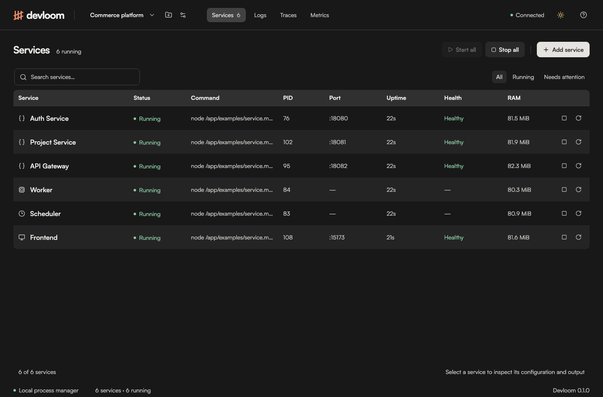
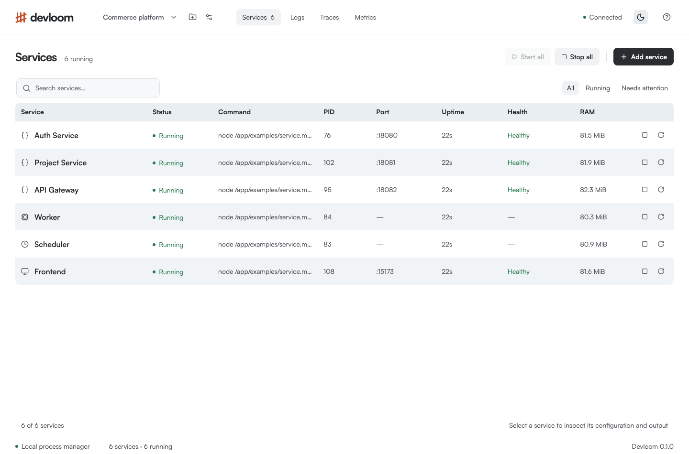
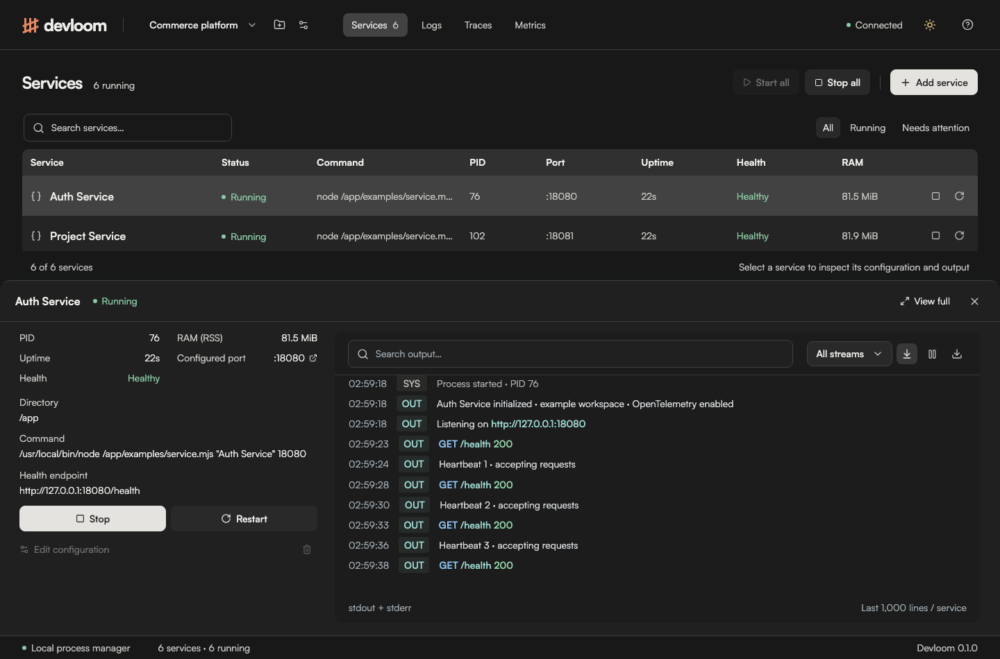
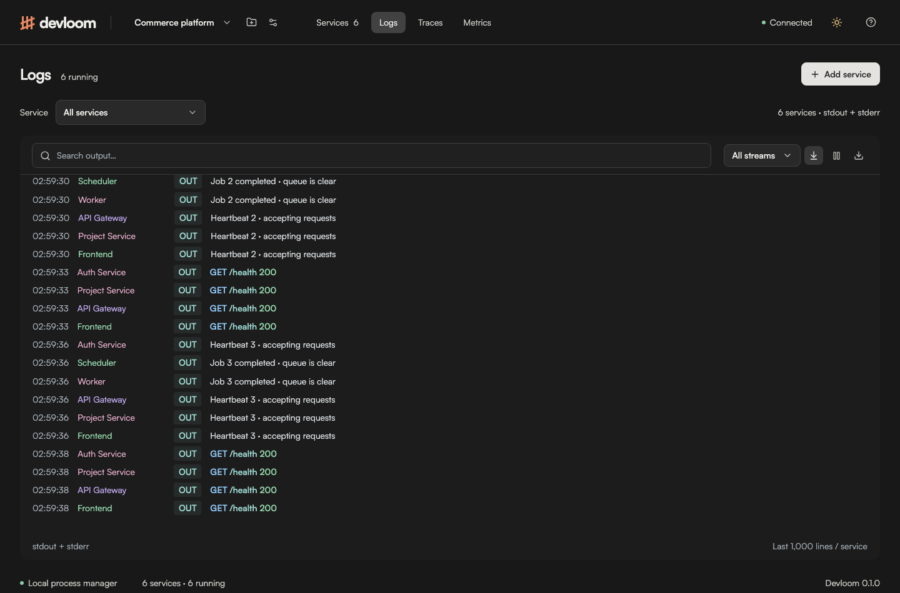
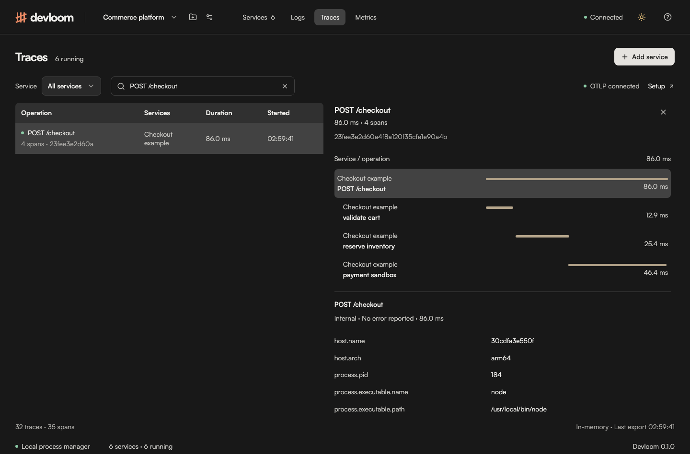
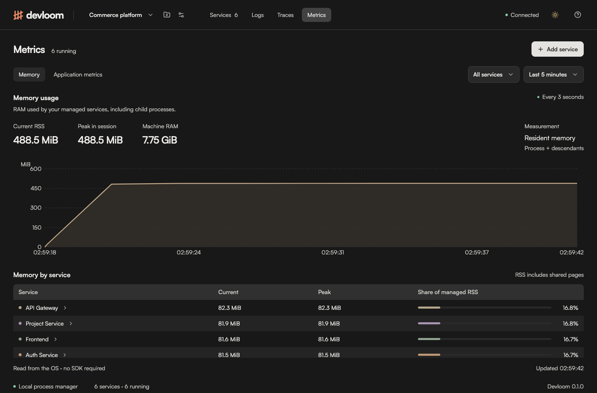
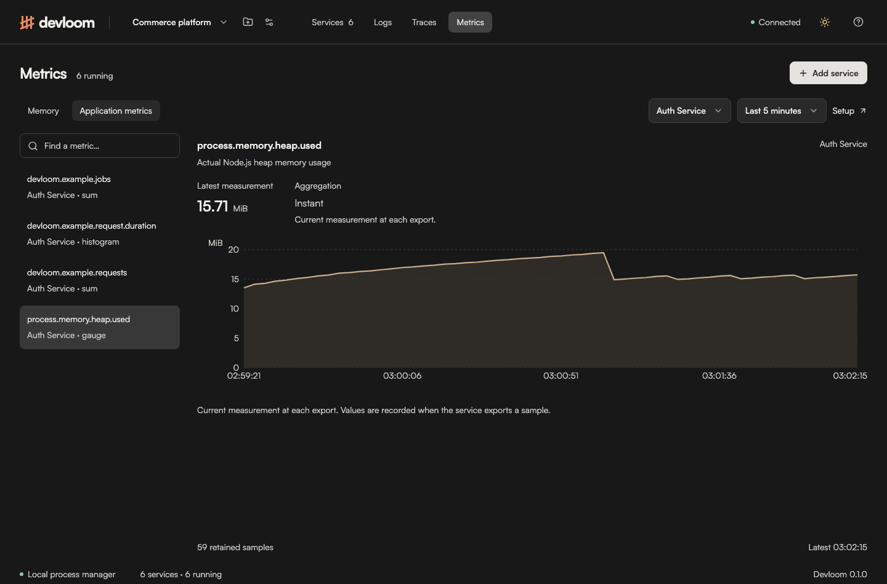
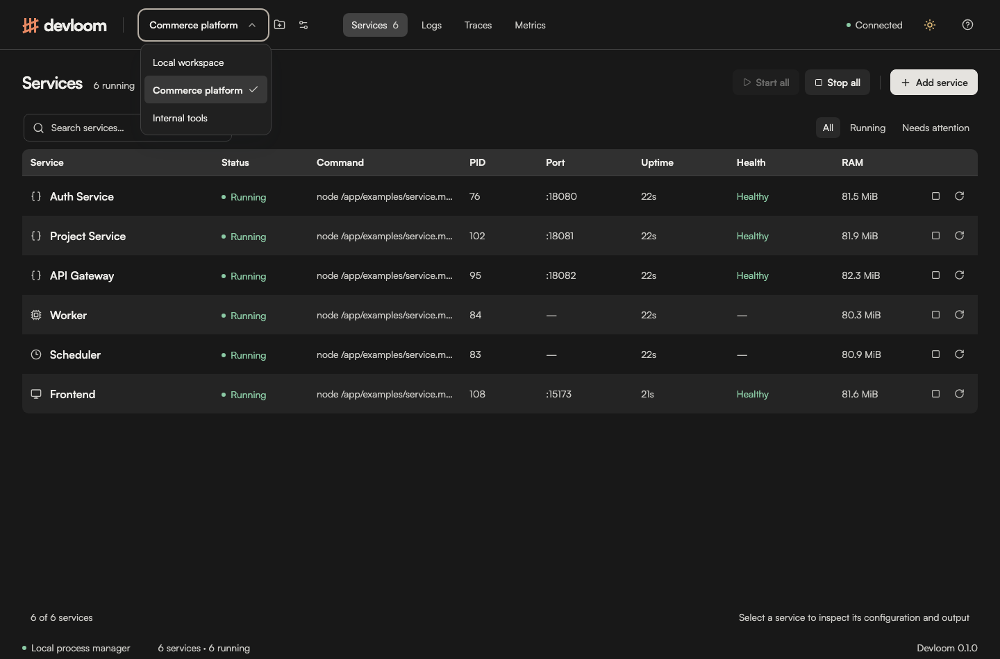
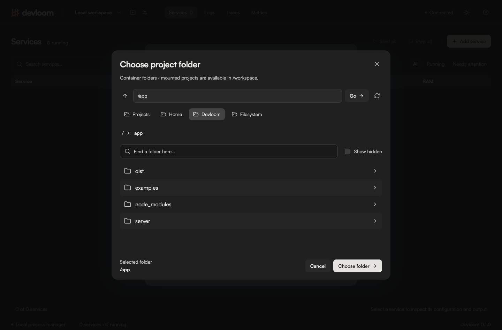

<p align="center">
  
</p>
<h1 align="center">Devloom</h1>
<p align="center"><strong>Weave your services into one workspace.</strong></p>

<p align="center">
  <a href="https://github.com/daisyorscry/devloom/actions/workflows/ci.yml"></a>
  <a href="LICENSE"></a>
  <a href="#installation"></a>
</p>

<p align="center">
  <a href="#installation">Get started</a> ·
  <a href="#features">Features</a> ·
  <a href="#screenshots">Screenshots</a> ·
  <a href="#contributing">Contribute</a>
</p>

Devloom is a local development control panel for running services, reading logs, checking health, and exploring application telemetry from one workspace.

Register the commands you already use—an API, worker, scheduler, frontend dev server, or another local process—then start, stop, and inspect them without switching between terminals.

The name combines **Development** and **Loom**: a workspace that brings the threads of a development environment together.

<picture>
  <source media="(prefers-color-scheme: light)" srcset="example/services-light.png" />
  
</picture>

## Why Devloom?

Working on several services usually means keeping several terminals open, remembering which port belongs to which process, and searching through separate logs when something fails. Devloom makes that environment easier to see and control.

It focuses on local development. Deployment, container orchestration, and production monitoring remain the responsibility of tools such as Docker, Kubernetes, and your production observability stack.

Devloom can manage any service that starts with a command. Your service can use Go, Node.js, Bun, Python, Rust, PHP, Java, .NET, or another runtime installed on your machine.

## Features

| Area                 | What you can do                                                                                                                                    |
| -------------------- | -------------------------------------------------------------------------------------------------------------------------------------------------- |
| Multiple projects    | Create, rename, and switch workspaces with separate services, logs, RAM history, traces, and metrics. Running services stay alive when you switch. |
| Service management   | Register, edit, and remove service configurations; start, stop, or restart individual services; start or stop the workspace.                       |
| Runtime details      | Inspect process status, PID, uptime, configured port, exit information, and optional HTTP health checks.                                           |
| Centralized logs     | Read live stdout/stderr, filter by service or stream, search text, pause the view, follow new output, and download filtered logs.                  |
| Log highlighting     | Distinguish streams, recognized log levels, service names, HTTP methods/status codes, URLs, and durations.                                         |
| Memory monitoring    | See process-tree RAM usage, session peaks, machine RAM capacity, history, and a per-service breakdown without an SDK.                              |
| OpenTelemetry traces | Receive local OTLP traces and inspect cross-service traces, span timing, attributes, and events.                                                   |
| Application metrics  | Receive OTLP metrics and inspect their values, units, descriptions, history, and explicit histogram distributions.                                 |
| Workspace UI         | Use a striped service table, a full-width bottom inspector, custom dropdowns, reusable search controls, and light/dark themes.                     |

The page stays within the viewport. Tables, logs, and other long content scroll inside their own regions. Theme selection initially follows the system and saves manual changes in the browser.

## Installation

### Requirements for running from source

- **Node.js 22.12 or newer** and npm.
- **macOS or Linux**. On Windows, run Devloom and your services inside WSL; native Windows process management is not supported.
- The runtime, dependencies, and local infrastructure required by each service you want to run.
- Available local ports: **4310** for the dashboard/API and **4318** for the telemetry receiver, unless configured otherwise.

### Run from source

Clone or download this repository, then run these commands from its directory:

```sh
git clone https://github.com/daisyorscry/devloom.git
cd devloom
npm ci
npm run dev
```

Open **[http://localhost:4310](http://localhost:4310)**.

Devloom serves its frontend, assets, and fonts locally. It does not require an account, a cloud service, or an external database. Docker and an OpenTelemetry Collector are not required for the default setup.

### Run a compiled build

```sh
npm run build
npm start
```

Run both commands from the repository root. The build compiles the frontend and server; it is still a local Devloom workspace.

### Run with Docker Compose

Copy `.env.example` to `.env` and set `DEVLOOM_AUTH_USERNAME` and a strong
`DEVLOOM_AUTH_PASSWORD` before starting. Compose requires both credentials.
The browser will show its built-in username/password prompt.

Install Docker Engine with the Compose plugin, or Docker Desktop, and start Docker. You do not need Node.js on the host for this option.

From the repository root:

```sh
docker compose up -d --build
```

Open **[http://localhost:4310](http://localhost:4310)**. The image builds from this checkout; no published Devloom image is required. Compose starts a non-root Node.js process, enables an init process, publishes the dashboard and OTLP ports on host loopback, and saves project/service configurations in the `devloom-data` named volume.

```sh
docker compose ps                    # Check startup and container health
docker compose logs -f devloom       # Read Devloom's own server output
docker compose stop                 # Gracefully stop Devloom and its services
docker compose start                # Start Devloom again
docker compose down                 # Remove the container; keep saved configurations
```

Read managed service output in Devloom's **Logs** view. `docker compose logs` shows the Devloom server's output. Saved services start in the stopped state after a container restart. Logs, traces, metrics, and RAM history are kept in memory and reset on restart. `docker compose down --volumes` also deletes saved projects and services, so use it only when intentionally resetting the workspace.

If the native app already uses the default ports:

```sh
DEVLOOM_PORT=4320 DEVLOOM_OTLP_PORT=4328 docker compose up -d --build
```

Then open `http://localhost:4320`; the receiver is at `http://127.0.0.1:4328`. Use the same variables when recreating the container. For a persistent Compose configuration, copy `.env.example` to `.env` and adjust the values beside `compose.yaml`:

```dotenv
DEVLOOM_PORT=4320
DEVLOOM_OTLP_PORT=4328
```

Compose reads this file for variable substitution; the native Devloom server does not load it itself. The internal and published port numbers deliberately match because Devloom checks the HTTP Host header.

### Run with Docker directly

```sh
docker build -t devloom:local .
docker run -d --name devloom --init \
  --stop-timeout 10 \
  --env-file .env \
  -p 127.0.0.1:4310:4310 \
  -p 127.0.0.1:4318:4318 \
  -v devloom-data:/data \
  devloom:local
```

Use `docker logs -f devloom`, `docker stop devloom`, and `docker start devloom` to inspect and control it. This command uses its own named volume, separate from Compose's project-prefixed volume. If changing ports, set `DEVLOOM_PORT` / `DEVLOOM_OTLP_PORT` with `-e` and publish those same ports.

### Basic authentication

Set `DEVLOOM_AUTH_USERNAME` and `DEVLOOM_AUTH_PASSWORD` in the server environment
to protect the dashboard, static assets, all workspace APIs, and live event streams.
For native use, export both variables before `npm run dev` or `npm start`.
Native and direct Docker runs keep authentication disabled when both values are
empty; incomplete credentials cause startup to fail. Docker Compose requires both.
Passwords may contain colons; usernames may not. Control characters are rejected.

Credentials are supplied at runtime and are never baked into the image. Managed
services do not inherit these two variables. API clients send the standard
`Authorization: Basic <base64(username:password)>` header; mutations still require
the existing `x-devloom-token` session token. Browsers cache Basic Auth credentials;
close the browser session to clear them.

Keep the existing localhost bindings. Basic Auth does not encrypt HTTP traffic;
use HTTPS if forwarding access through a trusted proxy. The separate local OTLP
receiver on port 4318 retains its existing ingestion behavior without Basic Auth.

To use a published image with Compose, set `DEVLOOM_IMAGE` to its Docker Hub tag,
then run `docker compose pull && docker compose up -d --no-build`.

### Run your services inside the container

**Containerized Devloom starts services inside its container.** It cannot manage existing host processes. Its projects are logical workspaces within that container, not separate containers, networks, or security boundaries. Run Devloom natively if you want to use runtimes and project paths already installed on your host.

The image includes **Node.js, npm, and the bundled examples**. To mount your own code, use the optional Compose file:

```sh
export DEVLOOM_PROJECTS_DIR="$HOME/projects"
docker compose -f compose.yaml -f compose.projects.yaml up -d --build
```

The host directory must already exist. A project at `$HOME/projects/auth` appears at **`/workspace/auth`** inside Devloom. Use that container path in the service form. The mount is writable; commands can change files in the mounted projects. The image runs as user `node` (UID 1000), which needs permission to read the project and write wherever the service requires it. On Linux, align directory ownership/permissions with that user.

For a Node service, install its dependencies inside the container before starting it:

```sh
docker compose -f compose.yaml -f compose.projects.yaml \
  exec -w /workspace/auth devloom npm ci
```

Do not reuse macOS/Windows `node_modules` inside Linux. If you also run the project natively, add a named volume for its container dependencies in a `compose.override.yaml`:

```yaml
services:
  devloom:
    volumes:
      - auth-node-modules:/workspace/auth/node_modules
    ports:
      - '127.0.0.1:8080:8080'

volumes:
  auth-node-modules:
```

Include all three files explicitly when using the optional project mount:

```sh
docker compose -f compose.yaml -f compose.projects.yaml -f compose.override.yaml up -d
```

After adding the dependency volume, rerun `npm ci` using that same set of Compose files. The example port mapping makes a service on port 8080 reachable from your host; the service itself must listen on **`0.0.0.0:8080`** inside the container. Entering a port in Devloom only records metadata—it does not publish Docker ports. Health checks still use `http://127.0.0.1:8080/health` from inside the container.

For Go, Bun, Rust, Python, PHP, Java, or .NET services, extend the image with the required runtimes/toolchains and dependencies. They are not included by default. Likewise, databases on the host or in other containers require the application's own Docker networking configuration; `localhost` inside a container refers to that container.

The dashboard's built-in RAM sampler measures managed Linux processes and their descendants. **Machine RAM** reflects the OS values visible inside the container, often the Docker VM; it is not a container memory-limit or host-process monitor.

### Try the example workspace

In an empty workspace, click **Load example workspace**, then **Start all**.

| Example         | Configured port |
| --------------- | --------------- |
| Auth Service    | 18080           |
| Project Service | 18081           |
| API Gateway     | 18082           |
| Worker          | None            |
| Scheduler       | None            |
| Frontend        | 15173           |

These are lightweight Node.js example processes, including an HTTP process labeled Frontend. They generate real logs and example telemetry from their own activity. They are not your applications and do not represent a complete microservice system. Loading examples registers them in the stopped state.

## Screenshots

These are actual captures of the running container with the bundled example services. The singular [`example/`](example/) folder contains screenshots; [`examples/`](examples/) contains runnable sample code.

| Services in light mode                                 | Full-width service inspector                                             |
| ------------------------------------------------------ | ------------------------------------------------------------------------ |
|  |  |

| Centralized, colored logs                          | Trace waterfall                                   |
| -------------------------------------------------- | ------------------------------------------------- |
|  |  |

| Process memory                                           | Application metrics                                |
| -------------------------------------------------------- | -------------------------------------------------- |
|  |  |

[View the mobile layout](example/mobile.png).

## Projects and workspaces

A **project** is a named workspace that groups the services you work on together.



1. Use **New project** beside the project dropdown in the header.
2. Enter a name, such as `Commerce platform`, and click **Create project**.
3. Add that project's services, or load the example workspace into the empty project.
4. Use **Switch project** to move between projects. The selection is remembered in that browser.
5. Open **Project settings** to rename it. Empty projects can be deleted; remove their services first. The original local workspace cannot be deleted.

Each project has independent service configurations, lifecycle actions, logs, RAM history, traces, and application metrics. **Start all** and **Stop all** apply only to the selected project. Switching closes the inspector and resets filters so another project's selection cannot leak into the view. Running services in other projects keep running; return to their project to stop them. Closing Devloom stops managed services across all projects.

Projects share the same operating system/container and available ports. Two projects cannot run services on the same listening port simultaneously. Service names may repeat across projects, and their telemetry remains separate when the correct project endpoint is used. Up to **50 projects**, each with **100 services**, can be registered.

Existing `.devloom/services.json` configurations remain in **Local workspace** without being moved. The project index is stored in `workspaces.json`; additional projects use `workspaces/<project-id>/services.json` under the configured data directory. Each browser can view a different project; selecting one does not switch other connected browsers.

### Telemetry for a specific project

Open **Traces → Setup** in that project and copy its exporter configuration. The default local workspace keeps the original endpoint. Additional projects use a dedicated base path:

```dotenv
OTEL_EXPORTER_OTLP_ENDPOINT=http://127.0.0.1:4318/workspaces/<project-id>
OTEL_EXPORTER_OTLP_PROTOCOL=http/protobuf
OTEL_SERVICE_NAME=auth-service
```

Replace `<project-id>` with the actual ID from the setup dialog. Shared-endpoint exporters append `/v1/traces` or `/v1/metrics`; signal-specific settings need the complete URL, such as `http://127.0.0.1:4318/workspaces/<project-id>/v1/traces`. Unscoped `/v1/traces` and `/v1/metrics` exports always belong to the original local workspace, regardless of which project is selected in the UI.

Devloom injects the project's endpoint into processes it starts unless the launching environment already overrides the exporter endpoint. Check inherited or explicitly configured SDK endpoints if telemetry appears in the wrong project. For Docker, use the configured receiver port. Services managed inside the container and SDKs running on the host can use the same loopback URL when the port is published; SDKs in other containers cannot use their own `localhost` to reach Devloom.

## Configure Devloom

| Environment variable    | Default                                | Purpose                                                                                                                             |
| ----------------------- | -------------------------------------- | ----------------------------------------------------------------------------------------------------------------------------------- |
| `DEVLOOM_PORT`          | `4310`                                 | Dashboard and API port.                                                                                                             |
| `DEVLOOM_OTLP_PORT`     | `4318`                                 | OTLP/HTTP receiver port; must differ from the dashboard port.                                                                       |
| `DEVLOOM_HOST`          | `127.0.0.1`                            | Bind address for both servers; accepts `127.0.0.1` or `0.0.0.0`. The Docker image uses `0.0.0.0` internally.                        |
| `DEVLOOM_DATA_DIR`      | `.devloom` under the working directory | Location of saved service configurations.                                                                                           |
| `DEVLOOM_PUBLIC_ORIGIN` | Unset                                  | Optional exact HTTP(S) origin accepted by the dashboard/API, for example `https://devloom.example.com`. Localhost remains accepted. |

For example:

```sh
DEVLOOM_PORT=4320 \
DEVLOOM_OTLP_PORT=4328 \
DEVLOOM_DATA_DIR=/absolute/path/to/devloom-data \
npm run dev
```

In this configuration, open `http://localhost:4320` and export telemetry to `http://127.0.0.1:4328`.

Set these variables in the shell that launches Devloom. Devloom does not automatically load a `.env` file.

For an explicitly configured reverse proxy, build Devloom and run it with the public origin:

```sh
npm run build
DEVLOOM_PUBLIC_ORIGIN=https://devloom.example.com npm start
```

Forward the original Host and Origin headers. This enables that exact dashboard origin;
other hosts, cross-origin requests, and mutations without a session token remain rejected.
The setting does not add authentication or change the OTLP receiver. Use the compiled build
behind a tunnel so the frontend does not depend on Vite's development WebSocket connection.

The dashboard/API and OTLP receiver bind to `127.0.0.1` by default. The container binds internally to `0.0.0.0` so Docker can forward its loopback-only published ports. Devloom runs commands with the permissions of the local user. Keep it local; it is not designed to be exposed as a public process-management API.

## Set up a service

1. Prepare the project and install its dependencies. Verify that its command works in your terminal.
2. Open Devloom and click **Add service**.
3. Next to **Project directory**, click **Browse** to open the folder explorer. Open folders, use the breadcrumbs or parent button, and click **Choose folder**. You can also type or paste a path directly.
4. Enter the remaining service configuration, then click **Add service** to save it.
5. Click **Start** and inspect the output and health status.



The explorer lists folders on the machine running Devloom. Search filters the current folder; **Show hidden** includes dot-prefixed folders. In Docker, it browses the container filesystem, including mounted projects under `/workspace`. It does not upload files or give the container access to unmounted host folders.

For a Go API, use:

| Field             | Example                        | Notes                                                                               |
| ----------------- | ------------------------------ | ----------------------------------------------------------------------------------- |
| Service name      | `Auth Service`                 | A readable name for this workspace.                                                 |
| Type              | `API / Backend`                | Choose API, Worker, Scheduler, Frontend, or Other.                                  |
| Project directory | `~/projects/auth`              | An existing absolute directory, or a path beginning with `~/`.                      |
| Command           | `go`                           | An executable on PATH, or an absolute executable path.                              |
| Arguments         | `run ./cmd/api`                | Arguments passed to the executable.                                                 |
| Port              | `8080`                         | Optional metadata; does not configure or discover the application's listening port. |
| Health endpoint   | `http://localhost:8080/health` | Optional local HTTP(S) health check.                                                |

Other command examples:

| Runtime        | Command  | Arguments                   |
| -------------- | -------- | --------------------------- |
| Bun frontend   | `bun`    | `run dev`                   |
| Node.js worker | `npm`    | `run worker`                |
| Python         | `python` | `main.py`                   |
| Rust           | `cargo`  | `run`                       |
| PHP            | `php`    | `artisan serve --port=8000` |
| Java           | `java`   | `-jar app.jar`              |
| .NET           | `dotnet` | `run`                       |

### Commands and environment

Devloom launches the executable directly, without a shell. Put the executable in **Command** and everything after it in **Arguments**. Quote arguments containing spaces, such as `run "folder with spaces/main.py"`.

Shell operators such as `&&`, pipes, globs, and `$VARIABLE` expansion are not evaluated automatically. If your workflow needs a shell, explicitly use `sh` as the command and an argument such as `-c "command-one && command-two"`.

Processes inherit PATH and environment variables from the terminal that started Devloom. There is currently no per-service environment-variable editor. Supply application configuration through that environment, your application's own configuration files, or an explicit wrapper command.

### Lifecycle and health

Select a service row to open its inspector. The table above remains scrollable. Click outside the inspector, use its close button, or press Escape to dismiss it. **View full** opens Logs with that service selected.

Stop a service before editing or removing its configuration. Removing it leaves the project files in place.

Health checks run every **5 seconds**, with a **2-second timeout**. HTTP 2xx responses are healthy. Health URLs must use `localhost`, `127.0.0.1`, or `[::1]`; redirects are not followed. A running process is not necessarily ready to serve requests—use a health endpoint when readiness matters.

## Read and filter logs

Open **Logs** to see output across the workspace or choose one service. Use the stream dropdown to select **stdout**, **stderr**, or **system**, and the search field to filter messages or service names.

- **Pause** freezes the displayed log list; the process continues running.
- **Follow** keeps the view at the latest output.
- **Download** exports the currently filtered view as text.
- **Clear** or Escape in a populated search field removes the query.

Colors help distinguish source streams and recognized severity labels. HTTP status codes, URLs, and durations receive separate highlights. Severity colors are display hints: stream filtering still uses the actual stdout/stderr/system source.

Devloom captures process output directly. A service does not need OpenTelemetry to appear in Logs. Terminal control sequences are stripped, and the console is not an interactive terminal.

## Set up OpenTelemetry

OpenTelemetry, or **OTel**, lets an instrumented application export traces and metrics to Devloom. The built-in receiver accepts **OTLP over HTTP**, with Protobuf or JSON payloads and gzip compression.

| Signal  | Default endpoint                   | Where to view it                  |
| ------- | ---------------------------------- | --------------------------------- |
| Traces  | `http://127.0.0.1:4318/v1/traces`  | **Traces**                        |
| Metrics | `http://127.0.0.1:4318/v1/metrics` | **Metrics → Application metrics** |

The receiver accepts payloads up to **4 MB**. OTLP/gRPC and OTLP log ingestion are not supported. This receiver is intended for local server-side SDKs; requests with a browser Origin header are rejected.

The endpoint examples below target the original local workspace. For another project, use its base URL from **Traces → Setup**, including the `/workspaces/<project-id>` path.

### Connect an application

1. Install and initialize your language's OTel SDK, the instrumentation you need, and an OTLP/HTTP exporter.
2. Configure its service name and Devloom's receiver endpoint.
3. Start the application and generate requests or other instrumented work.
4. Open **Traces** or **Metrics → Application metrics**, then select the service.

For SDKs that support standard exporter environment variables:

```sh
export OTEL_SERVICE_NAME="Auth Service"
export OTEL_EXPORTER_OTLP_ENDPOINT=http://127.0.0.1:4318
export OTEL_EXPORTER_OTLP_PROTOCOL=http/protobuf
```

The shared endpoint is the base URL. If you configure signal-specific endpoint variables instead, supply the full paths:

```sh
export OTEL_EXPORTER_OTLP_TRACES_ENDPOINT=http://127.0.0.1:4318/v1/traces
export OTEL_EXPORTER_OTLP_METRICS_ENDPOINT=http://127.0.0.1:4318/v1/metrics
```

SDK support and explicit configuration precedence vary by language. See the official [OTLP exporter configuration](https://opentelemetry.io/docs/languages/sdk-configuration/otlp-exporter/).

When Devloom starts a registered service, it sets `OTEL_SERVICE_NAME` to the registered name and supplies its receiver endpoint and `http/protobuf` as defaults. Existing shared exporter endpoint/protocol variables from the parent environment are preserved. Signal-specific exporter settings inherited by the application can also override the shared endpoint.

**Environment variables do not install or initialize instrumentation.** Your application must initialize its SDK or use an appropriate auto-instrumentation setup. Use the same OTel `service.name` as the Devloom service name for consistent filtering.

### Node.js example

The repository includes a working SDK helper in [examples/instrumentation.mjs](examples/instrumentation.mjs), a continuously running [example service](examples/service.mjs), and a [one-shot telemetry example](examples/telemetry.mjs).

With Devloom running, use a second terminal in the repository root:

```sh
npm run demo:telemetry
```

This exports a `POST /checkout` trace with four spans and two metrics under **Checkout example**, then exits. In **Traces**, open the trace to see its waterfall. In **Metrics → Application metrics**, search for `checkout.requests` or `checkout.duration`.

If the receiver uses a custom port:

```sh
OTEL_EXPORTER_OTLP_ENDPOINT=http://127.0.0.1:4328 npm run demo:telemetry
```

To reuse the helper in your own Node.js project, copy `examples/instrumentation.mjs` into that project and install its dependencies there:

```sh
npm install @opentelemetry/api @opentelemetry/sdk-node \
  @opentelemetry/resources @opentelemetry/sdk-metrics \
  @opentelemetry/exporter-trace-otlp-http \
  @opentelemetry/exporter-metrics-otlp-http
```

Initialize it before recording telemetry:

```js
import { instrument } from './instrumentation.mjs';

const { tracer, meter, shutdown } = instrument(process.env.OTEL_SERVICE_NAME || 'Auth Service');

const requests = meter.createCounter('app.requests', {
  description: 'Requests handled by this application',
  unit: '{request}',
});

tracer.startActiveSpan('example operation', (span) => {
  try {
    requests.add(1, { operation: 'example' });
    // Run the operation you want to observe.
  } finally {
    span.end();
  }
});

// For this short example, flush exports before exiting.
// In a server, call shutdown() during graceful application shutdown instead.
await shutdown();
```

This helper explicitly configures HTTP/JSON exporters and a 3-second metric export interval. Its explicit exporter URLs use the shared endpoint variable; it does not implement every standard OTel environment option. It records the spans and metrics you create rather than automatically instrumenting every library. For automatic HTTP/framework instrumentation, follow the official [Node.js instrumentation guide](https://opentelemetry.io/docs/languages/js/getting-started/nodejs/).

### Cross-service traces

A waterfall groups spans using their trace IDs and parent relationships. To follow a request across services, configure context propagation in the services' instrumentation. Registering processes in Devloom or giving them related names does not create trace relationships automatically.

## Metrics and memory

There are two data sources: **Memory** reads managed processes directly from the OS, while **Application metrics** displays values exported by your application's OTel SDK.

| Measurement                                                        | Available automatically?  | Setup                                              |
| ------------------------------------------------------------------ | ------------------------- | -------------------------------------------------- |
| Process-tree RAM (RSS)                                             | Yes, for managed services | Start a service and open **Metrics → Memory**.     |
| Machine RAM capacity                                               | Yes                       | Shown in the Memory overview.                      |
| Heap usage, request counts, latency, and other application metrics | No                        | Export the relevant instruments through OTLP/HTTP. |

### Memory usage

Devloom samples RAM every **3 seconds** using OS process information. The reading is **resident set size (RSS)**: resident memory for the managed process and its descendants that are still discoverable through the process tree.

The Memory view provides:

- Current usage and the highest sampled usage in the session.
- Total machine RAM capacity.
- A time-series chart with units and timestamps.
- Per-service usage, session peaks, and each service's share of managed RSS.
- Service and time-range filters.

The **RAM** column and service inspector also show the current reading. Memory sampling needs no SDK and retains **120 samples**, approximately six minutes at the regular sampling interval.

RSS is not heap size or unique physical memory. Shared pages can be counted more than once when summing processes. A service's share is its proportion of the managed RSS total, not its proportion of all machine RAM. Processes that detach and are no longer descendants may fall outside the reading. The built-in sampler measures only services managed by Devloom, not every process on the machine.

For language-specific memory details, export metrics such as heap usage through your SDK. The included Node.js service demonstrates this with `process.memory.heap.used`; it is separate from the OS RSS reading.

### Application metrics

Open **Metrics → Application metrics**, choose a service, and search for a metric. Its details include the description, unit, aggregation context, history, and attributes. A graph needs at least two retained samples; a single export shows a collecting-history state.

| Metric type                       | Current presentation                                                                                      |
| --------------------------------- | --------------------------------------------------------------------------------------------------------- |
| Gauge                             | Exported measurement at each timestamp.                                                                   |
| Sum/counter                       | Exported value, preserving cumulative or delta temporality.                                               |
| Histogram                         | Mean (`sum / count`) when available, otherwise count; explicit bucket distributions are shown in detail.  |
| Exponential histogram and summary | Aggregate values are accepted; exponential bucket distributions and summary quantiles are not visualized. |

Devloom displays exported values. It does not automatically turn counters into rates or calculate percentiles. Metrics with byte unit `By` are displayed in MiB. SDK export intervals determine how often new application samples arrive; they are independent of the built-in RAM sampling interval.

## Storage and process behavior

The original workspace saves services to `.devloom/services.json`; additional projects save to `.devloom/workspaces/<project-id>/services.json`. `workspaces.json` stores the project index. All paths are relative to `DEVLOOM_DATA_DIR` when configured; Docker uses `/data` in its persistent volume. Updates use an atomic file replacement. Up to **100 services** can be registered in a workspace.

Runtime history stays in memory:

| Data                | Retention limit                                           |
| ------------------- | --------------------------------------------------------- |
| Logs                | 1,000 lines per service, up to 8,192 characters per line. |
| Traces              | 300 traces, 10,000 spans total, and 500 spans per trace.  |
| Application metrics | 500 time series, up to 120 samples each.                  |
| Memory history      | Up to 120 samples per service and for the combined total. |

Restarting Devloom clears runtime history. Saved services remain registered but do not automatically start.

Closing the browser leaves processes running. Shutting down the Devloom server with `Ctrl+C` sends SIGTERM to managed process groups, then SIGKILL after a 3-second grace period when needed. A forced server kill, OS crash, or deliberately detached process can bypass normal cleanup. Automatic restart and crash recovery are not implemented.

## Project structure

```text
src/                       React + TypeScript + Tailwind CSS interface
src/components/            Focused views and shared UI primitives
src/globals.css             Fonts, theme tokens, reset, and animations
src/hooks/                 Data fetching, lifecycle, filters, and form controllers
src/lib/                   Pure command, service, trace, and metric helpers
src/useTheme.ts             System theme and saved theme preference
server/workspaces.ts       Project registry, isolated managers, and request routing
server/directories.ts      Folder browsing, path validation, and directory search
server/manager.ts          Process lifecycle, health, RAM, logs, and persistence
server/app.ts              Local API and server-sent events
server/telemetry.ts        OTLP receiver and bounded telemetry storage
server/proto/              Vendored OpenTelemetry protobuf definitions
example/                  Screenshots used in this README
Dockerfile                Multi-stage Node.js image with process sampling
compose.yaml              Local-only ports and persistent configuration volume
compose.projects.yaml     Optional host project directory mount
examples/                 Runnable services and instrumentation examples
tests/                    Unit, integration, and browser checks
```

See [DESIGN.md](DESIGN.md) for the interface conventions. Satoshi is provided by Indian Type Foundry / Fontshare; its license is in [public/fonts/Satoshi-LICENSE.txt](public/fonts/Satoshi-LICENSE.txt). Vendored OpenTelemetry protobuf definitions include their [Apache 2.0 license](server/proto/LICENSE). These assets and dependencies retain their own licenses.

## License

Devloom is licensed under the [MIT License](LICENSE), copyright 2026 Devloom contributors. The standard license text is available from the [Open Source Initiative](https://opensource.org/license/mit).

The bundled Satoshi font and vendored OpenTelemetry definitions retain their respective licenses linked above. Dependency licenses remain in their packages.

## Contributing

Contributions can improve process handling, SDK interoperability, accessibility, performance, documentation, or the everyday development workflow. Keep changes aligned with Devloom's focus on local development.

Read the [contribution guide](.github/CONTRIBUTING.md), open a [bug report or feature request](https://github.com/daisyorscry/devloom/issues/new/choose), and review the [security policy](SECURITY.md) before reporting a vulnerability. Create branches from `dev` and target `dev` in pull requests. Reviewed changes are promoted to `main`.

### Get started

1. Check existing issues and pull requests for related work.
2. For a substantial feature or architectural change, open an issue describing the problem and proposed approach before building it.
3. Fork the repository, clone your fork, check out `dev`, and create a focused branch such as `fix/log-filter` or `feat/service-health`.
4. Run `npm ci`, then `npm run dev` from the repository root.
5. Make the change, update relevant documentation, and run the appropriate checks.

```sh
npm run format
npm run check

# For UI changes, install the test browser once and run browser checks:
npx playwright install chromium
npm run test:e2e
```

`npm run check` runs formatting checks, TypeScript checking, automated tests, and the build. Browser checks use temporary workspaces and separate ports; test artifacts are written to `.devloom/artifacts/`. README screenshots live in `example/`.

For Docker changes, validate with `docker compose config --quiet`, rebuild the image, and verify container health, managed process lifecycle, OTLP ingestion, and configuration persistence across a container recreation. Use separate ports and test data.

Follow the existing TypeScript and Tailwind patterns. Use semantic theme tokens (`bg-panel`, `text-ink`, `border-line`) and shared `Button`, `TabButton`, `TableCell`, and `FormField` primitives. Put data loading and state transitions in `src/hooks/`, pure transformations in `src/lib/`, and presentation in the view components.

Run `npm run format` to format code and sort/wrap Tailwind classes; use `npm run format:check` to check without writing. The workspace recommends the Prettier VS Code extension and enables format-on-save when it is installed. Keep classes short by simplifying the layout or extracting a repeated component instead of adding nested selectors. UI changes should work in light/dark themes, with keyboard navigation, and at desktop/mobile sizes. Preserve the single font family, three text sizes, and independently scrolling workspace regions.

Do not commit `node_modules`, build output, `.devloom` data, `.env` files, credentials, or private service logs. When changing dependencies, include the updated lockfile and explain why the dependency is needed.

### Pull request rules

- Target `dev`. Keep each PR focused on one problem or closely related change. Avoid unrelated formatting or refactoring.
- Use a clear English title that describes the result, such as `Fix service filter after restart`.
- Explain the problem, the resulting behavior, and any meaningful tradeoffs or limitations. Link related issues when available.
- Include the checks you ran and their results. State clearly if a relevant check could not be run and why.
- Add regression coverage for behavior changes or bug fixes where it provides useful protection. Documentation-only changes should verify examples, links, and factual accuracy.
- Include screenshots or a short recording for visible UI changes, covering light/dark mode and mobile when affected.
- Document new configuration, behavior changes, and any compatibility or data-format impact.
- Keep a draft PR marked as draft while required work is unfinished. Before requesting review, resolve known test failures and review your own diff.

### Issue reporting rules

Search existing issues first. Open one issue per distinct problem and use a specific English title. Report observed behavior and include a minimal reproduction where possible.

For a bug report, include:

```text
Summary:
Devloom version or commit:
OS and version:
Node.js and npm versions:
Browser and version, if relevant:

Steps to reproduce:
1.
2.
3.

Expected behavior:
Actual behavior:

Relevant service command and arguments:
Relevant configuration or exporter settings:
Sanitized logs, error messages, or screenshots:
Workaround, if any:
```

For container issues, include Docker/Compose versions, image build output, published ports, volume/mount configuration, and whether the same service works natively. For multi-project issues, mention which project was selected and whether other projects were running.

For telemetry issues, also include the SDK language/version, exporter protocol, signal type, and a small sanitized payload or instrumentation example when possible. For process or resource issues, say whether child processes are involved.

For feature requests, explain the development problem, your current workaround, the behavior you want, and why it belongs in a local workspace. Keep requests separate from unrelated bug reports.

Remove tokens, credentials, personal data, and private paths or payloads before posting. Do not publish exploitable security details in a public issue; use a private reporting channel offered by the repository host or maintainer when available. Keep discussion respectful and provide additional reproduction details when requested.
